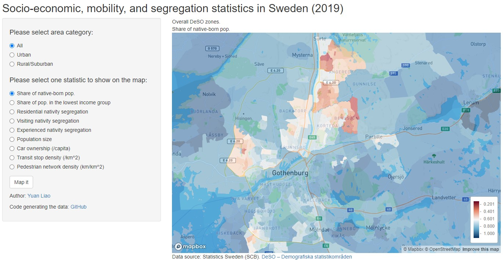

I am excited to share my recent experience presenting at the 9th International Conference on Computational Social Science, where I had the opportunity to connect with a fascinating and rapidly growing community of human mobility and social segregation in urban analytics and computational social science. This study investigates the below two research questions:

- How is experienced nativity segregation different from residential nativity segregation?
- What are the impacts of income level and transport accessibility on experienced nativity segregation by individuals?

Download the slides [here](/files/slides_IC2S22023_Yuan Liao.pdf).

Access the interactive map [here](https://yuanliao.shinyapps.io/InteractiveVisiSegSweden/), where you can play with the census statistics and the results from our study.

::: {.callout-warning}
Please note this is an ongoing study. The results may change depending on the evolving research focus and the analysis methods.
:::

## Nativity Segregation in a Polarized World

Nativism often leads to the clustering of people from different birthplaces into distinct communities, potentially causing negative impact on social cohesion and integration. This study aimed to shed light on the extent and implications of nativity segregation in Sweden, a country known for its ever-increasing segregation level since 1990.

## Leveraging the Power of Big Geolocation Data on Human Mobility

Quantifying social segregation using spatiotemporal approaches becomes feasible thanks to increasingly available mobility data from large populations. Although being in the same place (co-presence) does not always lead to social interactions, human mobility data provides a more realistic approximation of potential and actual interactions between groups.

Using geolocation data collected from a large population in Sweden (2019), this study looked at experienced nativity segregation in a comparison with the traditional static view i.e., residential segregation. Specifically, we examined the separation between foreign-born outside Europe vs. native-born populations.

## Key Findings

- Nativity segregation is still evident in various urban centers and regions across Sweden.
- When considering mobility, individual's experienced nativity segregation deviates from his/her residential segregation, calling for this more comprehensive approach driven by real-world data.
- Compared with the foreign-born, the native-born residents are more capable of reducing their nativity segregation level by moving toward places that are more diverse.
- Decreased nativity segregation when people move outside their home is associated with better transport access. But car and transit have different association patterns depending on foreign/native-born.

## Outlook

By addressing the drivers of segregation, we can pave the way for more sustainable and harmonious societies. By expanding the analysis to include a holistic set of explanatory variables such as mobility patterns and housing, we can gain a more nuanced understanding of nativity segregation and its evolving nature. Going from there, we can contribute to inclusive spatial planning.

## Remarks

This is the first study of our [MobiSegInsights project](https://github.com/MobiSegInsights) put together by a list of amazing researchers. It is my true honor to work with them.

Attending this conference also opens up exciting avenues for future investigations. A non-exhaustive list of relevant contributors from this conference is summarized below. You may also like their projects and papers if you are interested in our work.

### Social Segregation / Social Mixing / Inequalities

Understanding urban social resilience through behavioral mobility data. [Keynote](https://www.ic2s2.org/keynotes.html#esteban) by *Esteban Moro*.

#### Using Empirical Mobility/Place Data

- Disaggregating bike-share mobility data to measure urban segregation over time. *David Mingfei Liu*
- Mobility Connectedness: Uncovering socioeconomic bias and connectivity in urban mobility. *Damin Lee, Ohhyun Kwon, Inho Hong, Jaehyuk Park, Woo-Sung Jung, Hyejin Youn*
- How Can Transport Inequality Contribute to Housing Insecurity? *Nandini Iyer, Ronaldo Menezes, Hugo Barbosa*
- Network analysis reveals fare-free shared bike system improves community integration in Boston. *Nail Furkan Bashan, Qi Wang*
- Social-economic segregation dynamics at neighborhoods scale. *Lavinia Rossi Mori, Vittorio Loreto, Riccardo Di Clemente*
- Amenity complexity and urban locations of socio-economic mixing. *Sandor Juhasz*

#### Theoretical Models

- A Mobility-constrained Segregation Model. *Daniele Gambetta, Luca Pappalardo, Giovanni Mauro*
- Urban scaling laws arise from within-city inequalities. *Martin Arvidsson, Marc Keuschnigg*
