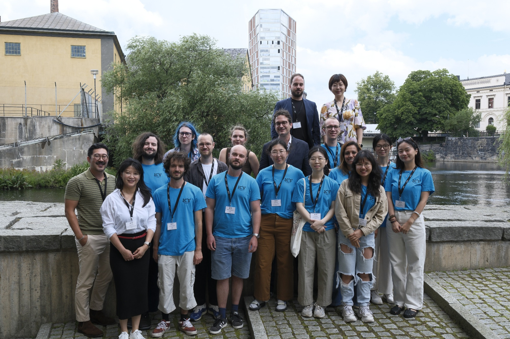
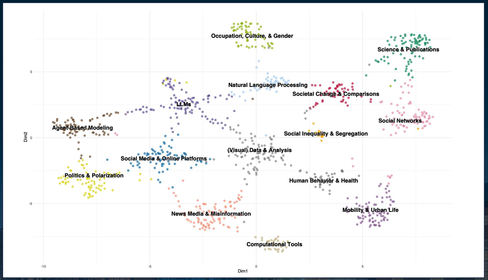

The 11th International Conference on Computational Social Science took place in Norrköping, Sweden, July 21–24, 2025 ([website](https://www.ic2s2-2025.org/)). I'm deeply honored to have been part of the organizing team.

As a transport researcher, my path into computational social science has been full of eye-opening moments. In a world where disciplinary boundaries keep blurring, IC2S2 showcases how diverse communities come together to form a strong, inspiring "big family."

My work sits at the intersection of transport, mobility data science, and urban science. A project on socio-spatial segregation and human mobility has brought me into close collaboration with computational social scientists, physicists, and complex systems researchers. In day-to-day research, we're much closer than we think—transport scholars, computational social scientists, and others can work together smoothly and keep inspiring each other.

Special thanks to my colleague Josef Ginnerskov, who modeled topic themes from this year's submissions and produced a fantastic visualization. Large Language Models (LLMs) feature prominently, serving as a connective thread that bridges diverse themes.

One cluster that especially resonates with my interests is Mobility & Urban Life. I'll zoom in on that topic cloud and share a few insights from the accepted papers presented at the conference.

## Highlights from Mobility & Urban Life

Relevant to my research focus on segregation, social mixing, and spatial inequality, there are a few studies about barriers, exposure, and who meets whom where, featuring the application of large amount of geolocation data:

- **Aiello et al. (2025)** overlays highway networks with a massive Twitter follower graph across 50 U.S. metros to compute a Barrier Score, showing highways systematically suppress cross-neighborhood social ties
- **Rosen et al.** apply Cuebiq mobility across 11 U.S. metro areas to measure how socioeconomic integration fluctuates over the day
- **Samaniego et al.** build SES-tagged call networks from Chile and Brazil and find robust socioeconomic homophily
- **Renninger** analyzes visits to ~5 million POIs showing downtowns drive more socioeconomic mixing than "bridge" amenities would predict

## Remarks

Two years after my last IC2S2 in Copenhagen, our socio-spatial segregation and mobility project has produced two papers and a preprint on segregation, social mixing, and spatial inequality ([project](https://github.com/MobiSegInsights)). Check them out:

- Liao, Yuan, et al. "The effect of limited mobility on the experienced segregation of foreign-born minorities." npj Sustainable Mobility and Transport 2.1 (2025): 29. [[Link](https://www.nature.com/articles/s44333-025-00046-4)]

- Liao, Yuan, et al. "Socio-spatial segregation and human mobility: A review of empirical evidence." Computers, Environment and Urban Systems 117 (2025): 102250. [[Link](https://doi.org/10.1016/j.compenvurbsys.2025.102250)]

- Liao, Yuan, et al. "Uncovering the Social and Spatial Effects of Fare Cuts on Public Transport with Mobile Geolocation Data." Available at SSRN 5179427. [[Link](https://dx.doi.org/10.2139/ssrn.5179427)]

Until next time.
