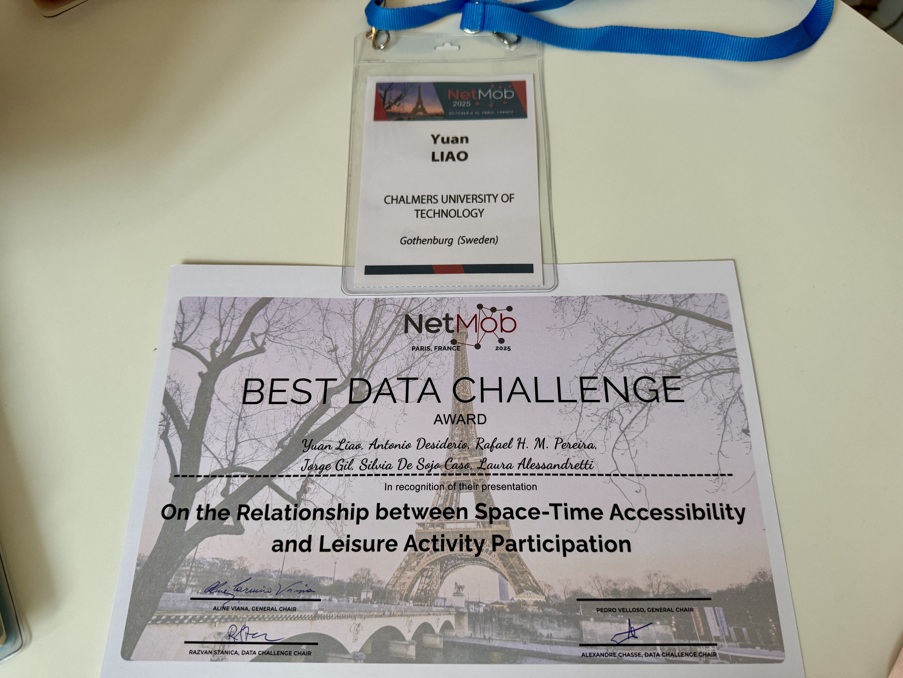
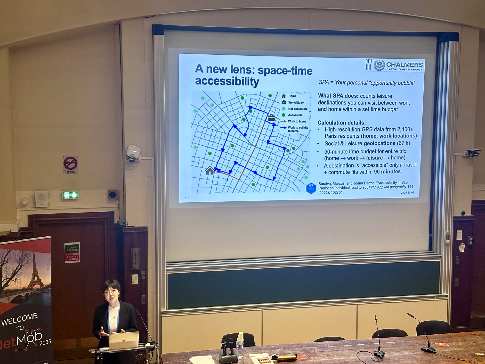

NetMob 2025 took place in Paris, France, October 8-10, 2025 ([website](https://netmob.org/www25/)). Our team received the Best Data Challenge Award.

Our work, titled "On the Relationship between Space-Time Accessibility and Leisure Activity Participation," explored how individuals' feasible access to leisure opportunities — shaped by transport systems, time budgets, and spatial inequality — impacts their actual participation in everyday life.

Big thanks to the NetMob 2025 organizing team and the data providers for the opportunity to work with such rich mobility data.

Check this preprint ([link](https://arxiv.org/abs/2510.10307)).
